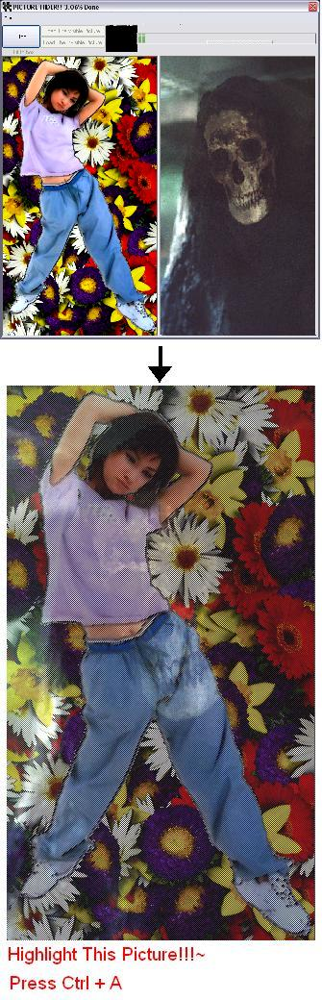



## Combine 2 pictures and make one only visible when highlighted \<Updated\>

### Description

It creates a picture which contains a visible picture and a invisible picture. when it is highlighted in a web browser it will reveal the hidden picture. This is the upgraded version of the my old submition. It uses setpixel and get pixel api so, it is a lot faster than the old one. Please leave me a comment..i also need some one to help me with a problem regarding the setpixel api; the api uses pixel while the vb uses point.. so how do i make the progressbar accurate.
 
### More Info
 

             |
---                |---
**Submitted On**   |2003-10-07 20:50:02
**By**             |[ISIEO](https://github.com/Planet-Source-Code/PSCIndex/blob/master/ByAuthor/isieo.md)
**Level**          |Intermediate
**User Rating**    |4.9 (34 globes from 7 users)
**Compatibility**  |VB 5\.0, VB 6\.0
**Category**       |[Graphics](https://github.com/Planet-Source-Code/PSCIndex/blob/master/ByCategory/graphics__1-46.md)
**World**          |[Visual Basic](https://github.com/Planet-Source-Code/PSCIndex/blob/master/ByWorld/visual-basic.md)
**Archive File**   |[Invisible\_1655101072003\.zip](https://github.com/Planet-Source-Code/isieo-combine-2-pictures-and-make-one-only-visible-when-highlighted-updated__1-49072/archive/master.zip)

